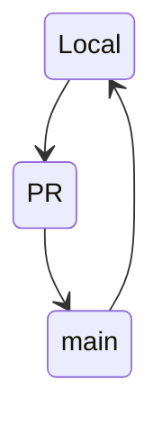
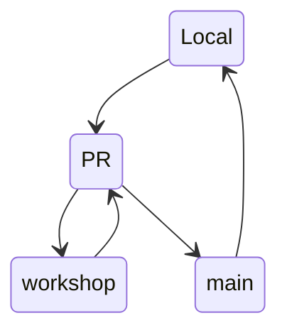
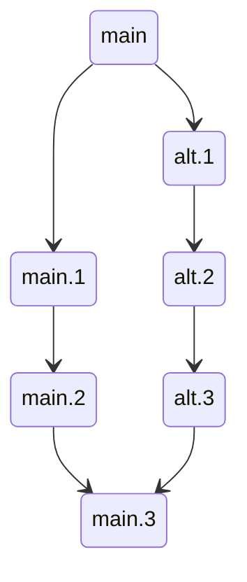

# KTH Domain Model

The purpose of the develper maintained KTH Domain Model is to share the understanding of the complex domain model of KTH and how it maps to different data sources.

Priorities:

1. Correctness
2. Readability
3. Maintainability
4. ~~Completeness~~ (Striving for completeness may be undesirable)

## Models

- **KTH domain model**

This gives us both a semantic overview of our domain, but also a common vocabulary that can simplify collaboration between teams and with collegues outside the IT-department.

- **Data source API models**
  - Domain model to source data mapping
  - Sample data

Since the internal data structures might differ from the exposed APIs, we focus on modelling the APIs we consume. The goal is not to duplicate existing API-documentation, but rather focus on how the API translates to the KTH domain model.

- **Data source event feeds**
  - Event feed to source data mapping
  - Sample data

Turns out that event feeds don't always resemble the API-endpoint they accompany.

## Contribution

We use tools that are well known and understood. With an open and transparent process of contribution we encourage collaboration.

### Refinements Through PRs
Simple PRs can be merged through online review:

More complex changes may require on-prem collaboration.

### Alternative Futures Through Branches
Future changes to systems can be modelled in branches allowing multiple stakeholders to investigate how the changes will affect current applications.

