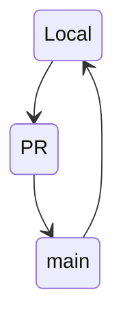
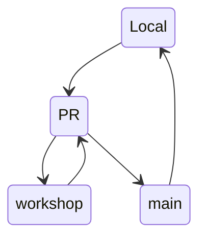
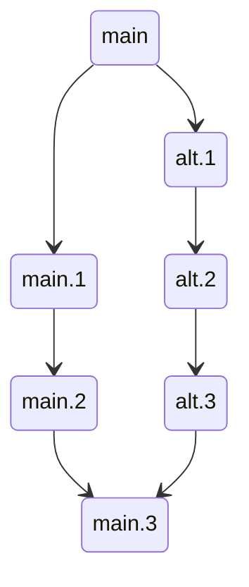

# KTH Domain Model

The purpose of the develper maintained KTH Domain Model is to share the understanding of the complex domain model of KTH and how it maps to source data.

Priorities:

1. Correctness
2. Readability
3. Maintainability
4. Completeness

## Contribution

By providing an open and transparent process of contribution we encourage collaboration.

### Refinements Through PRs
Simple PRs can be merged through online review:

More complex changes may require on-prem collaboration.

### Alternative Futures Through Branches
Future changes to systems can be modelled in branches allowing multiple stakeholders to investigate how the changes will affect current applications.

