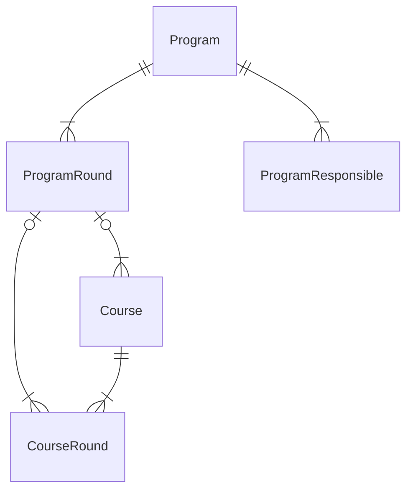
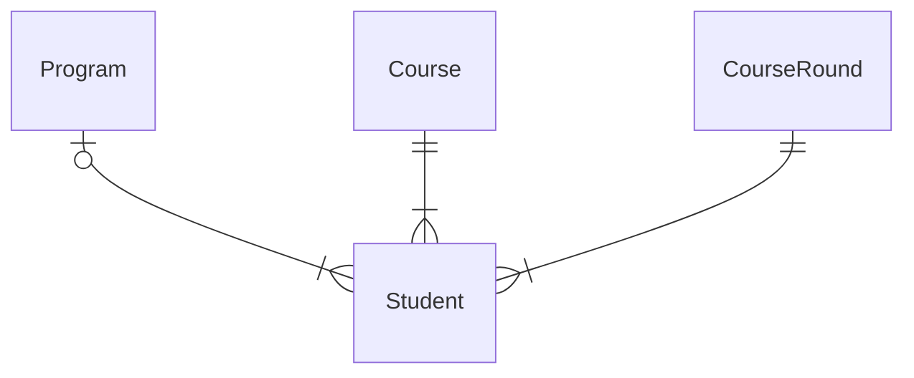
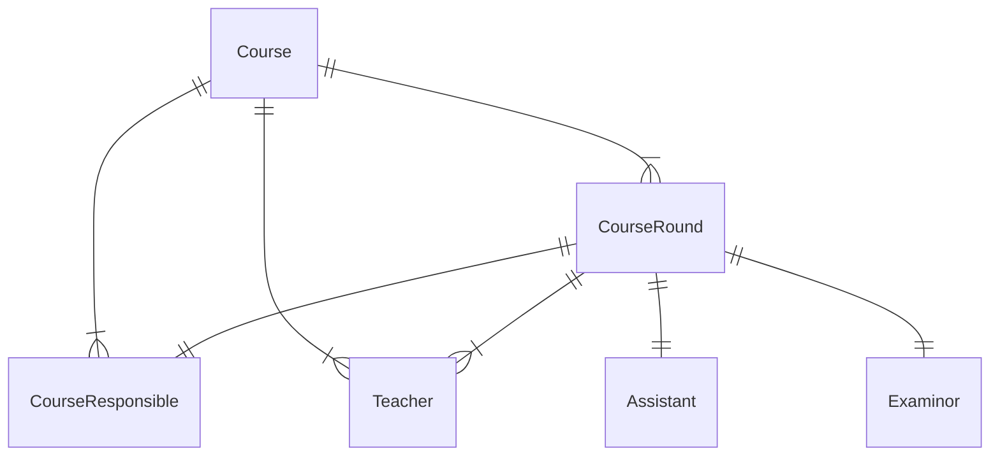

## KTH Domain Model
KTH is sometimes refered to as a program oriented university. A program is a study track with a set of mandatory and optional course that eventually leads a student to acquiring a degree.

### Program

------------

### Student

------------

### Course
