# Result on Course

NOTE: WORK IN PROGRESS

The transitions are named by required actions in the LADOK GUI.

## State Changes

```mermaid
sequenceDiagram
    actor ResultatCourse
    participant Utkast
    participant Klarmarkerad
    participant Attesterad
    participant Borttagen

    Utkast ->> Klarmarkerad:Klarmarkerat
    Klarmarkerad ->> Attesterad:Attesterat
    Attesterad ->> Borttagen:Ta bort resultat
    Note over Borttagen: TODO: Hur blir end state här?
```

------------

## Ladok Events

### Klarmarkerat

------------

### Attesterat

------------

### Ta bort resultat

------------