# Student Participation

REF: https://confluence.its.umu.se/confluence/pages/viewpage.action?pageId=730398886

## State Changes

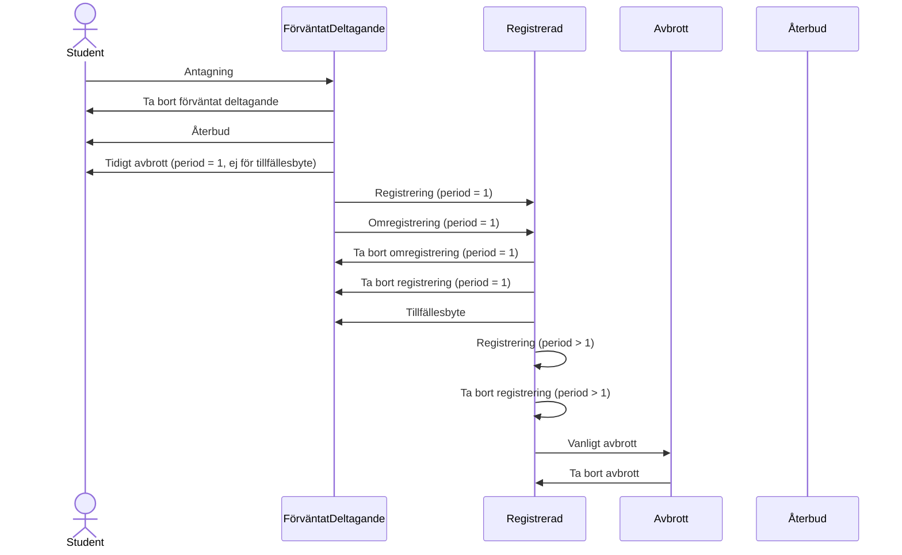

------------

## Ladok Events


### Antagning
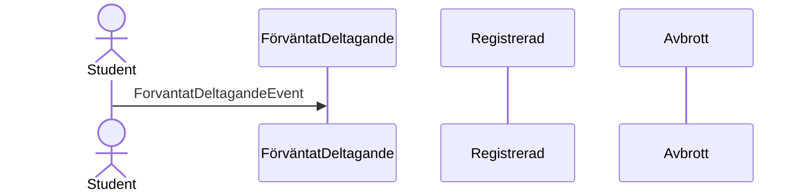
------------
### Återbud
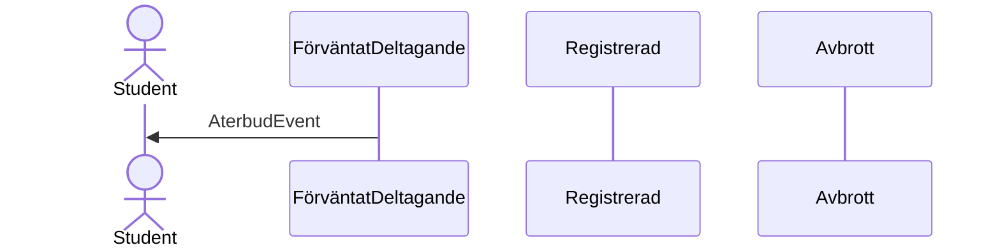
------------
### Ta bort förväntat deltagande
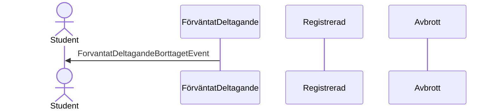
------------
### Tidigt avbrott (period = 1, ej för tillfällesbyte)
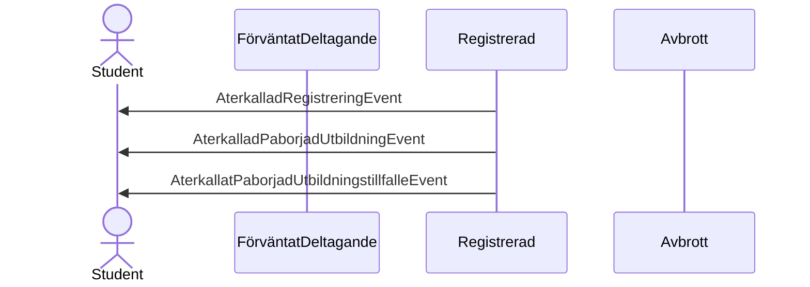
------------
### Registrering (period = 1)
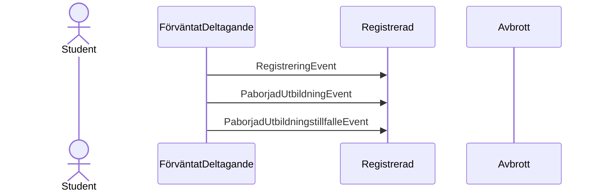
------------
### Omregistrering (period = 1)
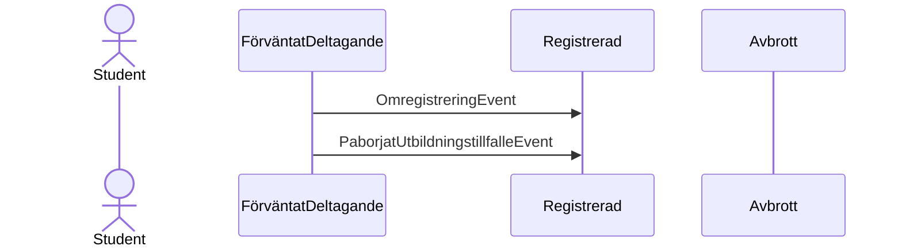
------------
### Tillfällesbyte
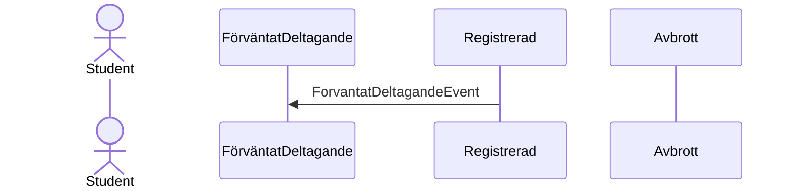
------------
### Ta bort omregistrering (period = 1)
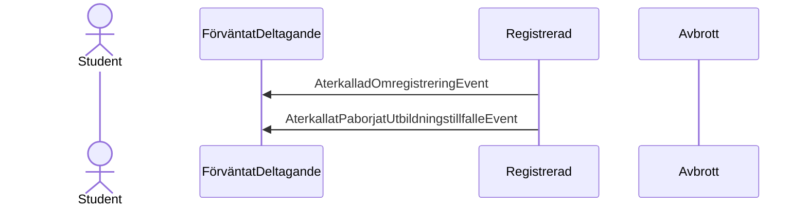
------------
### Ta bort registrering (period = 1)
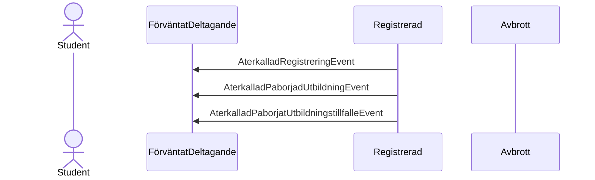
------------
### Registrering (period > 1)
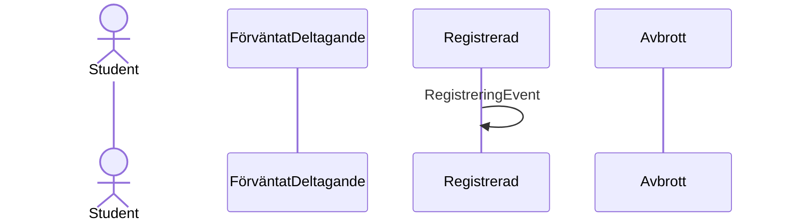
------------
### Ta bort registrering (period > 1)

------------
### Vanligt avbrott
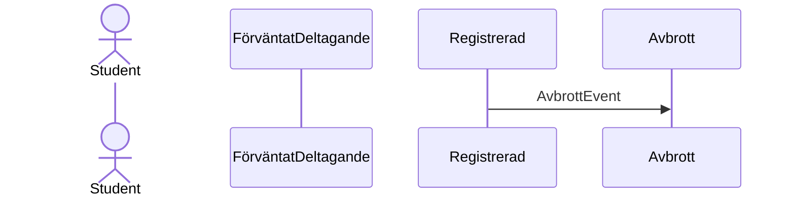
------------
### Ta bort avbrott
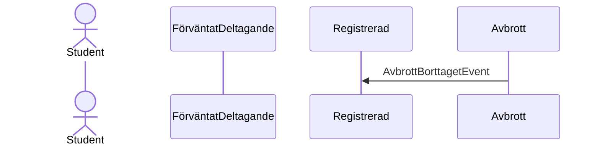

<!-- # Alternative Notation

NOTE: This isn't very readable unless we can do something about the styling.

```mermaid
sequenceDiagram
    actor Student
    participant FörväntatDeltagande
    participant Registrerad
    participant Avbrott

    par Antagning
      Student ->> FörväntatDeltagande:ForvatatDeltagandeEvent
    end

    par Återbud
      FörväntatDeltagande ->> Student:AterbudEvent
    end

    par Ta bort förväntat deltagande
      FörväntatDeltagande ->> Student:ForvantatDeltagandeBorttagetEvent
    end
    
    par Tidigt avbrott (period = 1, ej för tillfällesbyte)
      Registrerad ->> Student:AterkalladrRegistreringEvent
      Registrerad ->> Student:AterkalladrPaborjadUtbildningEvent
      Registrerad ->> Student:AterkalladrPaborjadUtbildningstillfalleEvent
    end

    par Registrering (period = 1)
      FörväntatDeltagande ->> Registrerad:RegistreringEvent
      FörväntatDeltagande ->> Registrerad:PaborjadUtbildningEvent
      FörväntatDeltagande ->> Registrerad:PaborjadUtbildningstillfalleEvent
    end
    
    par Omregistrering (period = 1)
      FörväntatDeltagande ->> Registrerad:OmregistreringEvent
      FörväntatDeltagande ->> Registrerad:PaborjatUtbildningstillfalleEvent
    end

    par Tillfällesbyte
      Registrerad ->> FörväntatDeltagande:ForvantatDeltagandeEvent
    end

    par Ta bort omregistrering (period = 1)
      Registrerad ->> FörväntatDeltagande:AterkalladOmregistreringEvent
      Registrerad ->> FörväntatDeltagande:AterkalladPaborjatUtbildningstillfalleEvent
    end
    
    par Ta bort registrering (period = 1)
      Registrerad ->> FörväntatDeltagande:AterkalladRegistreringEvent
      Registrerad ->> FörväntatDeltagande:AterkalladPaborjadUtbildningEvent
      Registrerad ->> FörväntatDeltagande:AterkalladPaborjatUtbildningstillfalleEvent
    end

    par Registrering (period > 1)
      Registrerad ->> Registrerad:RegistreringEvent
    end
    
    par Registrering (period > 1)
      Registrerad ->> Registrerad:AterkallaRegistreringEvent
    end

    par Vanligt avbrott
      Registrerad ->> Avbrott:AvbrottEvent
    end
    
    par Vanligt avbrott
      Avbrott ->> Registrerad:AvbrottBorttagetEvent
    end
``` -->
