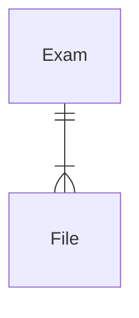

# Windreams Entities
WIP: Just a sketch

Windreams/TentaAPI is an archiving service that scans and stores physical paper subsmission.

### Exposed Model

------

### Exam

Property | Type | KTH Mapping
----

### File Entity

| Property | Type | KTH Mapping | Description |
| -------- | ---- | ----------- | ----------- |
| fileId | int | n/a | 
| documentIndiceses | object | n/a | 
| documentIndiceses.index | string | n/a | 
| documentIndiceses.value | string | se.kth.ug.user_id | KTH User ID
